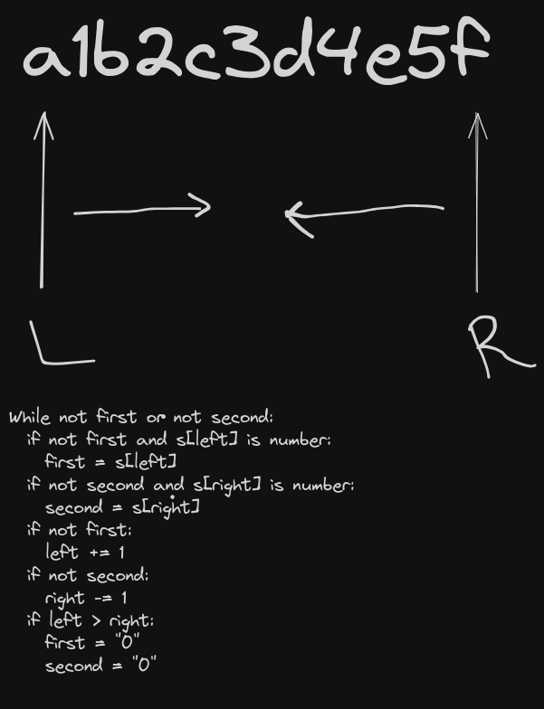
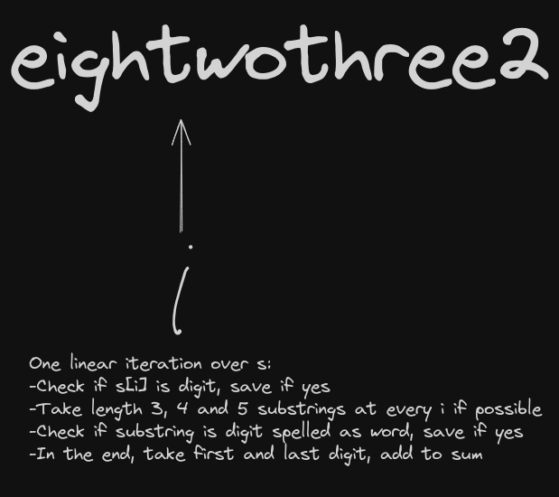

# Day 1 solution

https://adventofcode.com/2023/day/1

### Part 1

Two pointers, one from the beginning and one from the end approaching each other. We collect the first digits that the pointers encounter. This can be the same digit if there's only one in the string. In case there are no digits, stop iteration on that particular string once the pointers have crossed.

### Part 2

As the words can overlap (e.g. "eightwo" has eight and two as substrings) we do a linear pass over the string once and check if we are pointing at a digit or if we are pointing at the last letter of a relevant word. These are substrings of length 3, 4 and 5 at every i (if we are long enough into the string). Collect every digit and after passing the string, pick the first and last collected and add to the sum.

