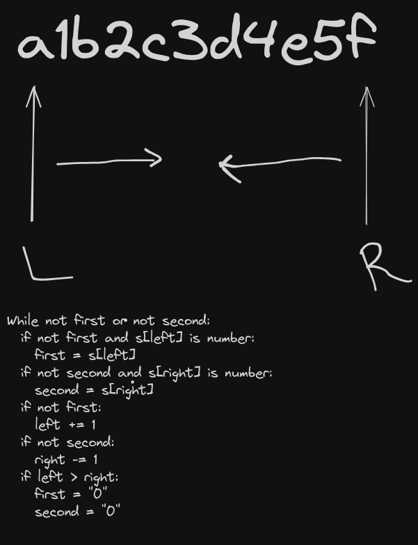

# Day 1 solution

### Idea

Two pointers, one from the beginning and one from the end, approach each other and we collect the first digit that the pointers encounter. This can be the same digit if there's only one in the string. In case there are no digits, stop iteration once the pointers have crossed and move to the next one.

