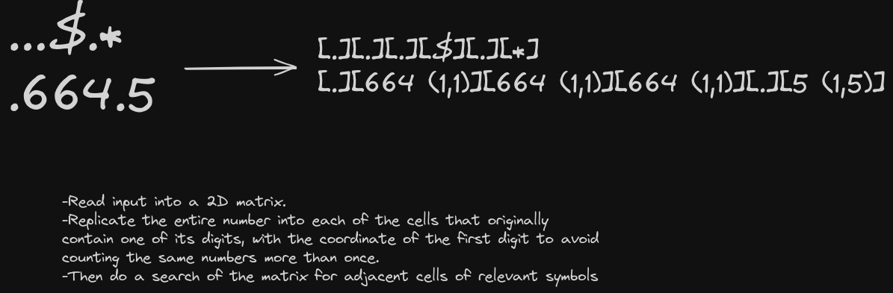

# Day 3 solution

https://adventofcode.com/2023/day/3

### Part 1

To find symbol-adjacent numbers we first read the input into a 2D matrix and populate the cells of every digit with the entire number that the digit is a part of. Also the coordinates of the first digit of the number is saved to avoid summing up the same number more than once later on. After this, doing an adjacency search of the matrix is simpler.

### Part 2

Same idea of an adjacency search but this time only look for "*" with two adjacent numbers and save those.

