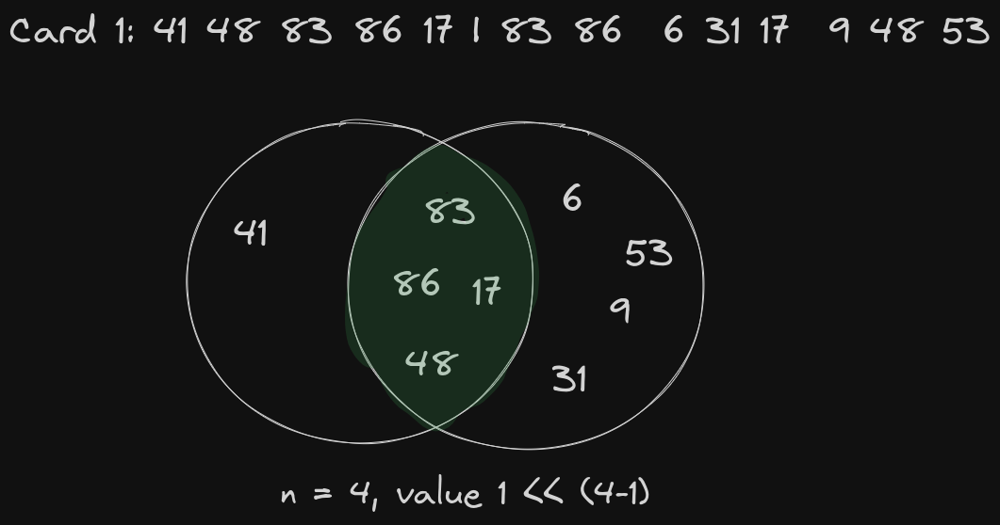
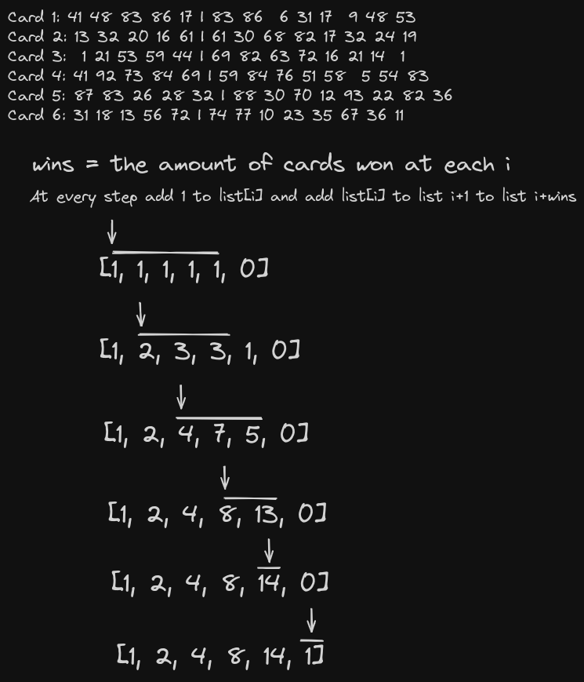

# Day 4 solution

### Part 1

There are two sets of numbers for each line in the input. We need the size of the intersection of these sets to count the points. Since they double on each matching number, the final value of the card is 1 << (n-1) where n is the size of the intersection.

### Part 2

Now we parse the number of matches from each card and save those in an array. After that we can iterate through the array and increase the amount of cards at each index according to the accumulated sum.

