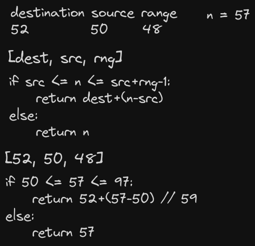

# Day 5 solution

https://adventofcode.com/2023/day/5

### Part 1

Iterate througn maps looking at the ranges for destinations. If destination cannot be mapped, return the input number. I parsed the maps to a linked list so it does not matter how many maps there are or their names, so long as they are in the correct order of iteration in the input.

### Part 2

"I didn't expect to tap out this early..."

Well gosh darn it. It seems that the solution from the first part does not really help with the second part. How does one do a search with an initial range without iterating through each number in said range... need to get back to this one!