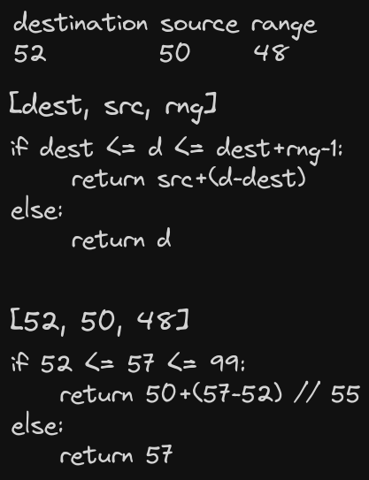

# Day 5 solution

https://adventofcode.com/2023/day/5

### Part 1

Iterate througn maps looking at the ranges for destinations. If destination cannot be mapped, return the input number. I parsed the maps to a linked list so it does not matter how many maps there are or their names, so long as they are in the correct order of iteration in the input.

### Part 2

We can do a reversed search from the end starting from 0 and iterate upwards until we get a result that fits in any of the initial seed ranges. Here we do not need to worry about anything else than what is the lowest location number that corresponds to _any_ of the seed ranges. Let the CPU do the talking.

