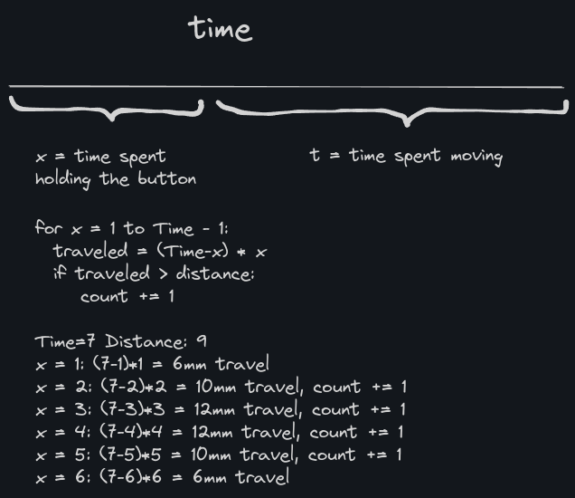
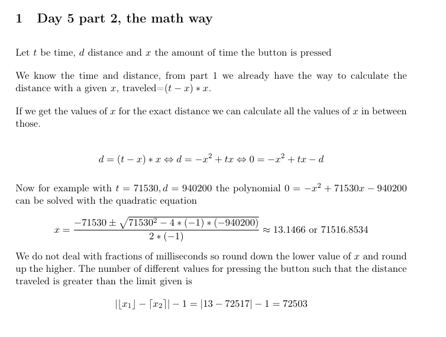

# Day 6 solution

https://adventofcode.com/2023/day/6

### Part 1

We need to count the different times spent pressing the button such that the distance traveled with the remaining time is over the limit. Iterate through the times and count.

### Part 2

Same thing as in part 1, although now there are more numbers to iterate. Optimization could be to not iterate the whole range, as the result distribution is symmetric around some middle value. Might be there is a mathy way to resolve this, but iteration was fast enough with the given input.

EDIT: Yeah, quadratic equation would give this straight away.
